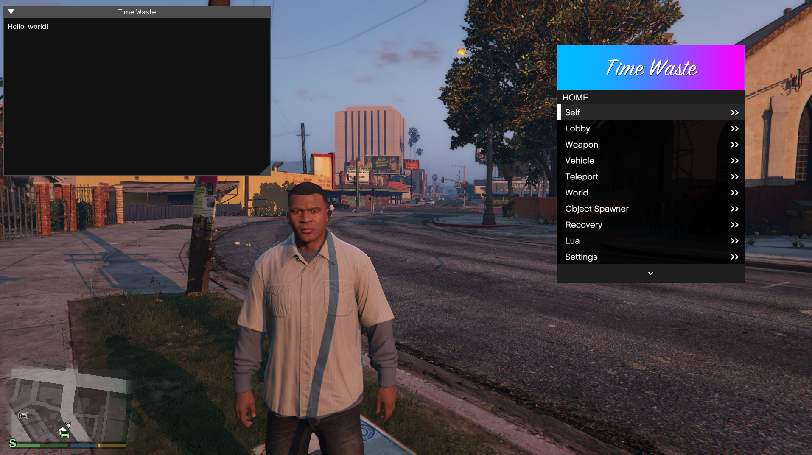
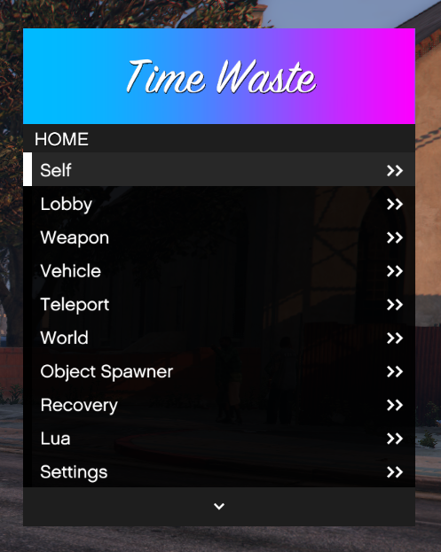
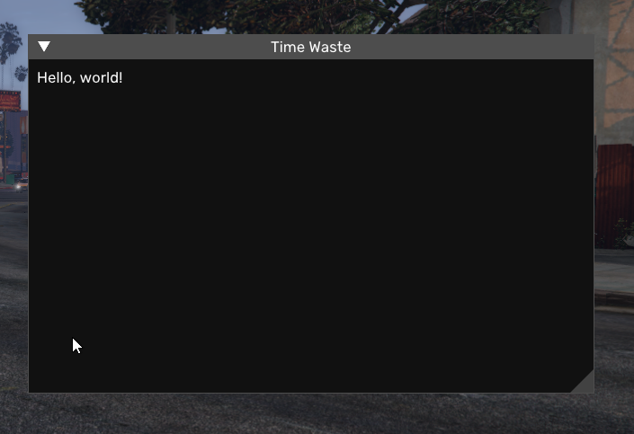

# This is where I waste my time

## A revived version of BigBase working on GTA5 v1.64

## About
### Has all the natives setup and up to date and it also includes ImGui. The main Menu is from BigBase.

## Keybinds
- F4 - Opens Menu
- INS - Opens ImGui
- END - Kills thread

## Images

[Pocakking](https://github.com/Pocakking)
